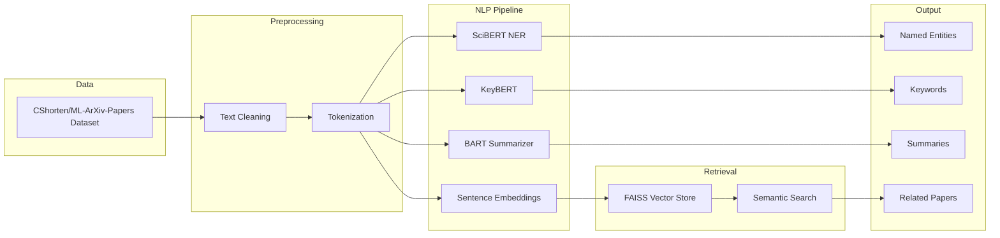

# 📚 AI-Powered Research Paper Analysis System

An NLP project that helps make Machine Learning research papers easier to explore by combining:

- 🔍 Scientific Named Entity Recognition (NER)
- 🔎 Semantic Search
- 🏷️ Keyword Extraction
- 📝 Abstractive Summarization

Instead of manually reading hundreds of papers to find relevant methods, datasets, or trends, this project aims to extract and organize information automatically.

---

# Why I Built This

The number of AI and Machine Learning papers published every year is growing rapidly. Finding answers to questions like:

- Which datasets are commonly used with a particular model?
- Which methods are becoming popular?
- What papers are related to my research topic?
- Which concepts frequently appear together?

usually requires reading a large amount of literature manually.

I wanted to explore whether modern NLP techniques could help transform research papers into structured and searchable knowledge.

---

# Project Overview

This project processes Machine Learning research paper abstracts and provides multiple capabilities:

### 🔍 Named Entity Recognition (NER)
Identifies important scientific entities from text, such as:

- Models and Algorithms
- Datasets
- Research Tasks
- Libraries and Frameworks

Example:

**Input**

```text
BERT achieved state-of-the-art results on the SQuAD dataset using PyTorch.
```

**Extracted Entities**

```text
BERT      → MODEL
SQuAD     → DATASET
PyTorch   → FRAMEWORK
```

---

### 🔎 Semantic Search

Traditional keyword search often misses papers that discuss similar ideas using different terminology.

This project uses:

- `sentence-transformers/all-MiniLM-L6-v2`
- FAISS similarity search

to retrieve semantically related papers rather than relying only on exact keyword matches.

---

### 🏷️ Keyword Extraction

Implemented using:

- KeyBERT

Automatically extracts important keywords and topics from research abstracts.

Example:

```text
Transformers
Question Answering
Transfer Learning
Computer Vision
```

---

### 📝 Research Paper Summarization

Implemented using:

- `facebook/bart-large-cnn`

Generates concise summaries of research paper abstracts to reduce reading time.

---

# Dataset

Dataset Used:

- `CShorten/ML-ArXiv-Papers`

The dataset contains Machine Learning research paper information including:

- Title
- Abstract
- Metadata

---

# Models Used

### Scientific NER
- `allenai/scibert_scivocab_cased`
- Refined using:
  - `zj88zj/SCIERC`

### Semantic Search
- `sentence-transformers/all-MiniLM-L6-v2`
- FAISS

### Keyword Extraction
- KeyBERT

### Summarization
- `facebook/bart-large-cnn`

---

# Project Pipeline

         

---

# Technologies Used

- Python
- Pandas
- NumPy
- PyTorch
- Hugging Face Transformers
- Sentence Transformers
- FAISS
- KeyBERT
- Scikit-learn
- Jupyter Notebook

---

# Potential Applications

This project can be extended into:

- 📚 Intelligent literature review assistants
- 🔍 Academic search engines
- 📈 Research trend analysis tools
- 🧠 Scientific knowledge graphs
- 🤖 AI-powered research assistants
- 📄 Automated paper recommendation systems

---

# Repository Structure

```text
.
├── NER implemented ml research paper project.ipynb
├── README.md

```

---

# What I Learned

This project gave me practical experience with:

- Natural Language Processing
- Scientific Named Entity Recognition
- Transformer Models
- Semantic Search using Embeddings
- Information Retrieval
- Text Summarization
- Building end-to-end NLP systems

---

# Future Work

Some ideas for improving this project:

- Process full papers instead of only abstracts.
- Add relation extraction between entities.
- Build a knowledge graph from extracted entities.
- Create an interactive web application.
- Add citation and author network analysis.

---

# Author

**Raja Sardar**

B.Tech in Artificial Intelligence & Data Science

Interested in Machine Learning, NLP, Information Retrieval, and building practical AI systems that help people work with large amounts of information more efficiently.
